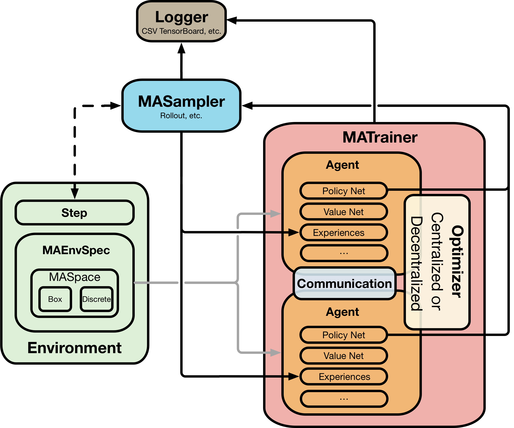

[](./VERSION)
[](https://github.com/tensorflow/tensorflow/releases)
[](./LICENSE)

# Multi-Agent Reinforcement Learning Framework

In this fork, I've made a new environment called simple_predator_prey, by modifying the simple_tag multi agent particle environment. The file is ```multiagent/scenarios/simple_predator_prey.py```

The environment has the following features:
1) Predators catch the prey when all of them are close enough to the prey
2) Predators can be encouraged to surround the prey from all sides by setting ```Scenario.enclose_rew = True```
3) Predators can be encouraged to avoid collision amongst themselves by setting ```Scenario.collision_rew =  True```


## Installation

Required Python Version: >= 3.6 
* Using anaconda (original repo gave more options)
```shell
cd malib
conda env create --file=environment2.yml
conda activate malib
conda develop ./
```

## Train

```shell
cd examples
python examples/run_particle.py
```

## Testing Code
Set file_format is 'npy' or 'csv'. The output file would have the information about the episode(s) which can be used to render in a different environment.

```shell
python examples/render_particle.py
```
Renders, prints statistics and generates output file

### npy format
* There is a .npy file corresponding to the same 10 episodes.
	* Use the command:
	all_obs = ```np.load('simple_predator_prey_different_rew.npy', allow_pickle = True).item()```
	* all_obs is a dictionary of 10 elements corresponding to the 110 episodes
	* all_obs['0'] is a Tx4x4 dimensional array
		* 1st dimension corresponds to the time steps
		* 2nd dimension corresponds to the 4 agents, I think first 3 are predators and the 4th one is the prey
		* 3rd dimension contains [xvel, yvel, xpos, ypos]
    
### csv format
  *	size (Tx4)x4. T is length of episode 
  * 	1st 4x4 contains data for t=1, 2nd 4x4 contains data for t = 2, ...
  *	In 1st 4x4 elements:
    *	1st 3 rows contain data for 3 predators
    *	last row contains data for single prey
    *	each row has [xvel, yvel, xpos, ypos]


## Reference Projects
The project implementation has referred much and adopted some codes from the following projects: [agents](https://github.com/tensorflow/agents), [maddpg](https://github.com/openai/maddpg), [softlearning](https://github.com/rail-berkeley/softlearning), [garage](https://github.com/rlworkgroup/garage), [markov-game](https://github.com/aijunbai/markov-game), [multiagent-particle-env](https://github.com/openai/multiagent-particle-envs). Thanks a lot!


This Framework aims to provide an easy to use toolkit for
Multi-Agent Reinforcement Learning research.
Overall architecture:



Environment: There are two differences for Multi-Agent Env Class: 1. The step(action_n) accepts n actions at each time; 2. The Env class needs a MAEnvSpec property which describes the action spaces and observation spaces for all agents.

Agent: the agent class has no difference than common RL agent, it uses the MAEnvSpec from Env Class to init the policy/value nets and replay buffer.

MASampler: Because the agents have to rollout simultaneously, a MASampler Class is designed to perform the sampling steps and add/return the step tuple to each agent's replay buffer.

MATrainer: In single agent, the trainer is included in the Agent Class. However, due to the complexity of Multi-Agent Training, which has to support independent/centralized/communication/opponent modelling, it is necessary to have a MATrainer Class to abstract these requirements from Agent Class. This is the core for Multi-agent training.
